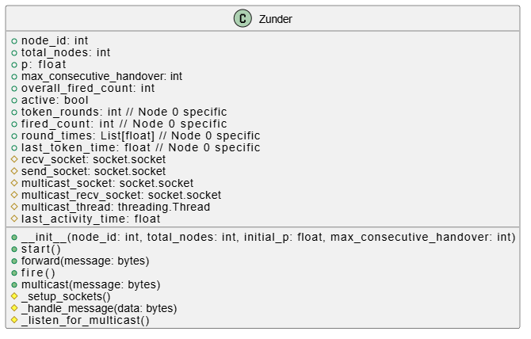
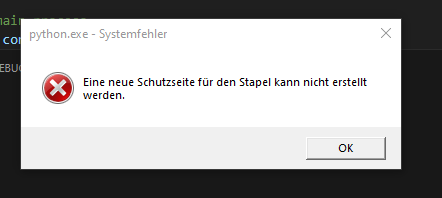

# Übung1/Aufgabe1

## How to run

Für die Lösung der Aufgabe 1 habe Python verwendet.
Am besten ist es, eine geteilte Virtual Environment im Ordner Uebung1 für Aufgaben 1 und 2 zu erstellen.

```python
### Navigate to Uebung1 dir
cd Uebung1

### Create venv inside Uebung1
python -m venv .venv

### Activate .venv on Windows
.\.venv\Scripts\activate
### or macOS and Linux
source .venv/bin/activate

### Install dependencies from requirement.txt
pip install -r requirements.txt
```

Um den Code auszuführen, tun Sie Folgendes:

```python
### Navigate to Aufgabe1 dir
cd Aufgabe1
### Run the code
python start.py
```

Über das Terminal werden dann verschiedene Parameter für die Simulation abgefragt.

## Dokumentation

Die Klasse Zunder stellt einen Node des Ringnetzwerks dar.



Über die Methode `_setup_sockets()` werden die vier nötigen Sockets für den Node erstellt: je zwei für die Multicast- und Unicast-Kommunikation (Senden und Empfangen).  
In einem Thread lauscht der Node nach Multicast-Nachrichten. Auf diesem Wege erhält er entweder die Nachricht, dass ein anderer Node gezündet hat, oder dass das Ringnetzwerk terminiert wurde. Die Methode `start()` startet diesen Thread und wartet im Anschluss auf Unicast-Nachrichten vom Vorgänger. Die Überreichung des Tokens erfolgt immer in Kombination mit der Anzahl der aktuellen aufeinanderfolgenden Fehlzündungen. Zündet der Node, setzt er diesen Wert auf 0 zurück und leitet das Token weiter an den nächsten Knoten. Kommt es zu einer Fehlzündung, prüft der Knoten anhand der Variable `max_consecutive_misfires` (in folgenden Aufgaben in max_consecutive_misfires unbenannt), ob er den Ring terminieren muss. Zur Terminierung sendet er einen Multicast an alle Ringteilnehmer. Der `multicast_thread` empfängt diese Nachricht und setzt im Anschluss die Variable `active` auf `False`, wodurch der Prozess beendet wird.

In dieser Aufgabe erhebt lediglich Node 0 Statistiken über das Ringnetzwerk. Bei jedem Tokenempfang erhöht er die Variable `token_rounds` und stoppt die Rundenzeit, um sie im Array `round_times` einzutragen. So werden immer nur komplettierte Runden gemessen – die Runde, in der der Ring terminiert wird, wird also hier nicht erfasst. Außerdem zählt Node 0 die Anzahl der empfangenen Multicasts, die ihn über das Zünden eines anderen Knotens benachrichtigen (`fired_count`). Am Ende liest das Skript `start.py` diese Statistiken aus den Variablen von Node 0 aus und schreibt sie in die Konsole. Mit `start.py` können außerdem mehrere Experimente mit unterschiedlichen Knotenanzahlen direkt hintereinander ausgeführt werden (siehe Konsolen-Parameter-Abfrage beim Start).

Zur Erhebung des maximal zu erreichenden `n` habe ich alle Konsolenausgaben und kurzen Wartezeiten auskommentiert. Lediglich zwischen den Initialisierungen der Nodes gab es ein kleines Päuschen. Initialisiert werden konnten rund 600 Nodes – hier war aber dann beim Simulationsstart Schluss. Eine reibungslose Simulation konnte ich noch mit circa 400 Nodes durchführen. Hier lag die Rundenzeit bei 81.62 Sekunden (mit `p = 0.4` und 170 gesendeten Multicasts). Sie hängt aber stark von der Wahrscheinlichkeit `p` ab, mit der die Nodes zünden. Mit kleinem `p` werden weniger zeitintensive Multicasts gesendet.
Die Versuche eines Vergleichs mit den anderen Werten können Sie der Dokumentation zu Aufgabe 2 entnehmen.

**Lustige Anmerkung**: Mein erster Approach war es, mich von oben anzunähern, und ich habe daher mit 10.000 Nodes angefangen. Bei der Initialisierung von ca. Node Nummer 650 wurde mein Bildschirm für einige Sekunden schwarz, bevor ich mit einer schönen Fehlermeldung wieder begrüßt wurde (siehe Bild). VS Code war im Anschluss ebenfalls unresponsive, und einer meiner beiden Bildschirme wurde nicht mehr erkannt. VS Code musste auch im Anschluss noch mehrfach gewaltsam beendet werden 😄.


