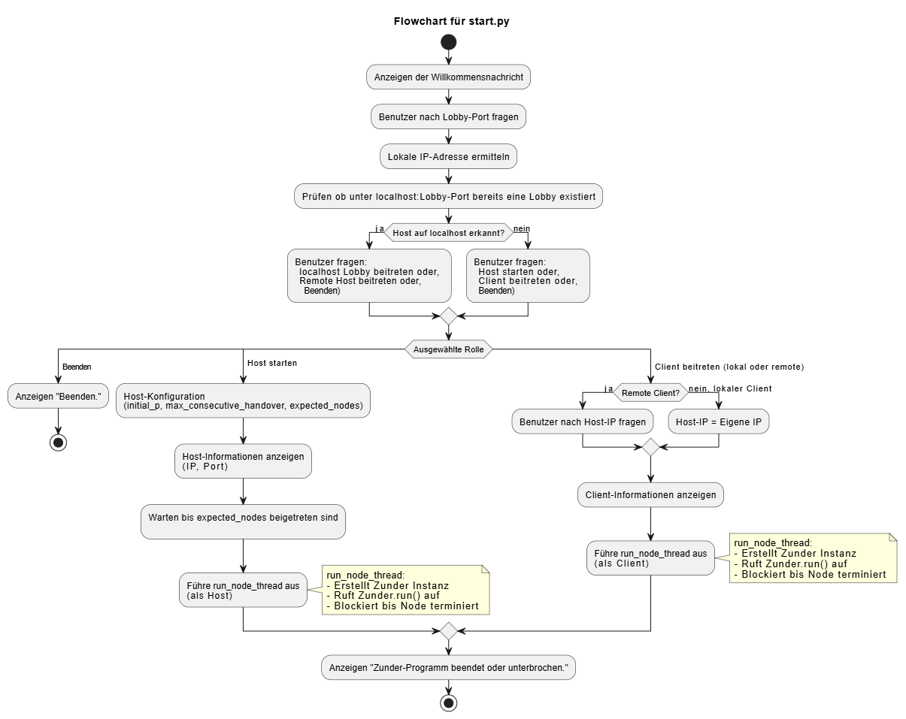
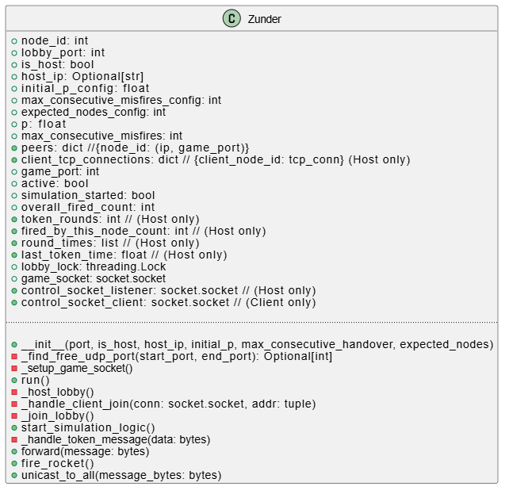

# Übung1/Aufgabe2

## How to run

Für die Lösung der Aufgabe 2 habe ich ebenfalls Python verwendet.  
Die Ausführung ist äquivalent zu der aus Aufgabe 1.

```python
### NUR VENV ERSTELLEN, FALLS NOCH NICHT IN AUFGABE 1 GESCHEHEN
### Navigate to Uebung1 dir
cd Uebung1

### Create venv inside Uebung1
python -m venv .venv

### Activate .venv on Windows
.\.venv\Scripts\activate
### or macOS and Linux
source .venv/bin/activate

### Install dependencies from requirements.txt
pip install -r requirements.txt
```

Um den Code auszuführen, tun Sie Folgendes:

```python
### Navigate to Aufgabe1 dir
cd Aufgabe1
### Run the code
python start.py
```

## Dokumentation

Die Klasse `Zunder` stellt einen Node des Ringnetzwerks dar.

### Grundprinzip

In dem Ringnetzwerk gibt es einen Host (immer `node_id = 0`). Dieser öffnet einen TCP-Port und nimmt JOIN-Requests von anderen Nodes entgegen. Er antwortet mit einem ACK (Acknowledgement) oder REJECT. Im Falle eines ACK wartet der Node auf eine START_SIMULATION-Nachricht des Hosts. Diese enthält Informationen zur Konfiguration des Rings (`initial_p`, `max_consecutive_misfires`) sowie die Daten aller anderen Teilnehmer (IP und UDP-Port). Anschließend wartet der Node, bis er zum ersten Mal das Token erhält.

Da ich keinen Erfolg beim Versenden von Multicasts oder Broadcasts in meinem Heimnetzwerk hatte, sendet der Node im Falle einer Zündung eine Unicast-Nachricht an alle anderen Teilnehmer.

Außerdem übernimmt das Skript `start.py` nun zentrale Aufgaben. So erfragt es etwa, ob ein neues Ringnetzwerk initialisiert werden soll (Node hostet neue Lobby) oder ob einem bereits bestehenden Netzwerk beigetreten werden soll. Daher habe ich ein Flowchart erstellt, das den Prozess darstellt:



Zu Beginn wird nach dem Lobby-Port gefragt und überprüft, ob auf `localhost:port` bereits eine Lobby gehostet wird. Wenn ja, kann dieser beigetreten werden oder – durch Eingabe einer Host-IP – einer anderen Lobby mit gleichem Port im Netzwerk. Falls nicht, kann eine neue Lobby auf diesem Port gehostet werden.

Dies ermöglicht es, mit einem Rechner mehrere Prozesse im Ringnetzwerk zu registrieren, während gleichzeitig Prozesse anderer Rechner im Netzwerk beitreten können.

Die `Zunder`-Klasse wurde um die Lobby-Host- und Beitritts-Funktion erweitert. Die Simulationslogik bleibt aber größtenteils unverändert.



Node 0 ist wieder für das Erheben der Statistiken verantwortlich. In einer Erweiterung könnte man nach dem Terminieren der Token-Weitergabe auch noch die Ergebnisse durch den Ring propagieren. In der aktuellen Version printet jedoch nur der ursprüngliche Host die Statistiken ins Terminal.

Um die Ergebnisse zwischen den Experimenten vergleichbar zu halten, habe ich mich für folgendes Vorgehen entschieden:

1. Terminalausgaben und `sleep`s wurden auskommentiert.
2. Ringnetzwerk mit 3 Nodes (wegen der Hardware-Limitierung in Aufgabe 2).
3. Gemessen wird die erste Runde. Dafür nutze ich eine Zündwahrscheinlichkeit von `1`, damit garantiert jeder Node zündet.

Dazu habe ich erneut eine Messung mit meinem Code aus Aufgabe 1 durchgeführt:

|                              |          Anmerkung           | Anzahl Nodes | Zeit der ersten Runde (alle zünden; Durchschnitt über 5 Versuche) |
| :--------------------------- | :--------------------------: | :----------: | :---------------------------------------------------------------: |
| Aufgabe 1                    |     alle 3 Nodes auf PC      |      3       |                              2.34 ms                              |
| Aufgabe 2 (PC als Host)      | Node 0: MB<br>Node 1 & 2: PC |      3       |                             77.33 ms                              |
| Aufgabe 2 (MacBook als Host) | Node 0 & 1: PC<br>Node 2: MB |      3       |                              6.13 ms                              |

Bei Aufgabe 2 ist mir aufgefallen, dass es auch einen signifikanten Unterschied macht, wer der Host ist, da dieser die Statistiken erfasst und z. B. Rundenzeiten berechnen muss.  
Hier wird mir mal wieder aufgezeigt, wie schnell mein MacBook im Vergleich zu meiner Windows-Gurke ist.  
Im Gegenzug verwandelt es sich ab fünf geöffneten Chrome-Tabs zuverlässig in ein hochmodernes Laubgebläse. 😄
