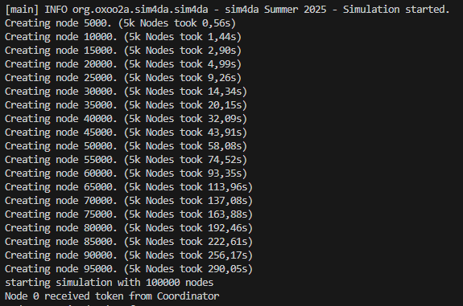

# Übung1/Aufgabe3und4

## How to run

```java
// Navigate to Uebung1/Aufgabe3und4/sim4da
cd Uebung1/Aufgabe3und4/sim4da

// Run Aufgabe 3
// With ring_size=20, init_p_fire=0.8, max_consecutive_misfires=6
// Parameter need to be changed in OneRingToRuleThemAll.java
mvn compile exec:java -Dexec.mainClass="org.oxoo2a.sim4da.OneRingToRuleThemAll"

// Run Aufgabe 4
// With ring_size=20, init_p_fire=0.8, max_consecutive_misfires=6, waitTime=15000
// Parameter need to be changed in ConsistentRingToRuleThemAll.java
mvn compile exec:java -Dexec.mainClass="org.oxoo2a.sim4da.ConsistentRingToRuleThemAll"
```

## Aufgabe 3

Der Coordinator erstellt eine Nachricht (siehe unten) und startet den Ring, indem sie an Node 0 gesendet wird.  
Hierfür musste ich die `Message`-Methode `add()` weiter überladen, um zum Beispiel eine `ArrayList<Double>` zur Nachricht hinzufügen zu können.

```java
// Payload (ring configuration)
m.add("token", "continue");
m.add("max_consecutive_misfires", max_consecutive_misfires);
m.add("consecutive_misfires", 0);

// Stats
m.add("total_forwards", 0);
m.add("total_fires", 0);
m.add("total_misfires", 0);
m.add("total_roundtrips", 0);
List<Double> roundtrip_times = new ArrayList<Double>();
m.add("roundtrip_times", roundtrip_times);
m.add("p_fail", 0f);
```

Die Nachricht wird dann rundgereicht und entsprechend bearbeitet. `total_forwards` wird bspw. immer um 1 inkrementiert.  
Wenn ein Node feststellt, dass `max_consecutive_misfires` erreicht wurde, sendet er noch einmal die Nachricht mit `token="end"` via der Node-Methode `broadcast()` an alle anderen Nodes im Netzwerk.  
Dadurch haben am Ende der Simulation alle Knoten die finalen Statistiken.  
Um eine Terminal-Flutung zu vermeiden, printet aber immer noch nur Node 0 diese.

### Belastungstest

Ein Bottleneck scheint hier die Initialisierung neuer Nodes zu sein, die mit zunehmender Anzahl immer langsamer wird (siehe Foto):



Mit 100.000 Nodes funktioniert die Simulation tatsächlich noch – wenn auch mit ächzendem Rechner.  
Zwar entsprechend langsam, aber es wird bei einer Zündung immerhin ein `broadcast` an 100k Nodes simuliert.  
Angesichts meines leidenden PCs habe ich mich dann entschlossen, es dabei zu belassen.
Dies steht natürlich in keinem Verhältnis zu den 400 Nodes aus Aufgabe 1.  
Die wichtigsten vermuteten Gründe für diese Diskrepanz:

1. In Aufgabe 1 hat jeder Node einen eigenen Prozess
2. Effizientere Implementierung
3. Java vs Python Speed

Folgende Tabelle beschreibt die Geschwindigkeitsunterschiede:

|                              |                       Anmerkung                       | Anzahl Nodes | Zeit der ersten Runde (alle zünden; Durchschnitt über 5 Versuche) | Zeit pro Step |
| :--------------------------- | :---------------------------------------------------: | :----------: | :---------------------------------------------------------------: | :-----------: |
| Aufgabe 1                    | alle 3 Nodes auf PC (jeweils eigener Prozess); Python |      3       |                              2.34 ms                              |    0.78 ms    |
| Aufgabe 2 (PC als Host)      |             Node 0: MB<br>Node 1 & 2: PC              |      3       |                             77.33 ms                              |   25.77 ms    |
| Aufgabe 2 (MacBook als Host) |             Node 0 & 1: PC<br>Node 2: MB              |      3       |                              6.13 ms                              |    2.04 ms    |
| Aufgabe 3                    |                  im Simulator; Java                   |      3       |                              1.37 ms                              |    0.45 ms    |

## Aufgabe 4

Wahre Konsistenz würde bedeuten, dass jeder Node zu jedem Zeitpunkt über die aktuellen Stats informiert ist.  
Um dies zu realisieren, müsste allerdings bei jeder Token-Weiterreichung eine Nachricht an alle anderen Nodes gesendet werden.  
Der dadurch entstehende Netzwerk-Traffic wäre jedoch, besonders bei großen Ringnetzen, erheblich.

Ich denke, dass meine Lösung aus Aufgabe 3 einen guten Kompromiss darstellt:  
Zwar haben die Nodes während der Rundreichung unterschiedliche Informationsstände, jedoch am Ende – durch den Broadcast – einen synchronisierten Stand.  
Trotzdem habe ich weitere Maßnahmen implementiert, die die Zuverlässigkeit und Konsistenz des Systems verbessern:

1. **Nutzung von `send()` statt `sendBlindly()`**  
   Dies garantiert, dass der Empfänger sich im Ring befindet, und beugt damit dem "Verlieren" des Tokens vor.
2. **Implementierung eines Zeitlimits**  
   Der Coordinator besitzt nun ein Argument `waitTime`. Wenn dieses erreicht ist, beendet der Coordinator den Ring.  
   Die Nodes wissen dann, dass sie über unterschiedliche Informationsstände verfügen und printen diese mit einem Disclaimer ins Terminal.  
   Durch das Zeitlimit wird sichergestellt, dass der Ring auch bei "Tokenverlust" terminiert.

Simuliert werden kann dies mit `ConsistentRingToRuleThemAll.java` (siehe oben).

Da ich deutlich weniger Erfahrung mit Java (im Vergleich zu Python) besitze, war der Implementierungsaufwand – oder besser gesagt die dafür benötigte Zeit – ähnlich wie in Aufgabe 1.  
Außerdem hat das Verständnis des Codes ohne Dokumentation oder Kommentare seine Zeit gekostet... :D  
Aufgabe 2 war, entsprechend dem größeren Funktionsumfang, am aufwendigsten.
