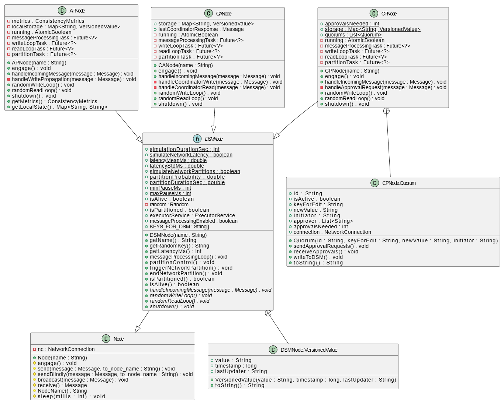

# Übung2

## How to run

```java
// Navigate to Uebung1/Aufgabe3und4/sim4da
cd Uebung2/sim4da

// Run the DSM Simulation.
mvn compile exec:java -Dexec.mainClass="de.marvinxmo.versys.dsm.testing.DSMTestSuite"
```

Über das Terminal werden dann verschiedene Parameter für die Simulation abgefragt.

## Implementierung

Zentraler Bestandteil meiner Implementierung sind die drei verschiedenen Node-Typen **APNode**, **CANode** und **CPNode**. Alle basieren auf der abstrakten Superklasse **DSMNode**, in der Funktionen der Simulation implementiert sind, die von allen DSM-Typen benötigt werden. So wird zum Beispiel die Partitionierung eines Knotens verwaltet und es werden zufällige Latenzen generiert, die einer festgelegten Normalverteilung entnommen werden und in der Simulation Verwendung finden. Außerdem besitzt die Klasse statische Variablen, die die in der Terminalabfrage festgelegten Parameter speichern und so den drei Unterklassen zur Verfügung stellen. Die spezifischeren logischen Elemente der verschiedenen DSMs sind dann vollständig in den jeweiligen Node-Klassen implementiert. Dazu definiert **DSMNode** beispielsweise die abstrakten Methoden `randomWriteLoop` und `randomReadLoop`. Alle Node-Typen generieren in zufälligen zeitlichen Abständen **Write**- und **Read**-Anfragen. Im DSM wird jeweils eine `Map<String, VersionedValue>` verwaltet, wobei ein Key auf ein **VersionedValue**-Objekt verweist. Ein **VersionedValue**-Objekt enthält die drei Attribute `value`, `timestamp` und `lastUpdater`.  
Standardmäßig werden die Keys `"giraffe"`, `"zebra"`, `"lion"`, `"elephant"`, `"monkey"` und `"koala"` verwaltet. Die `randomWriteLoop` schreibt diesen Keys dann jeweils einen acht Zeichen langen zufälligen String zu.



### APNode

Jeder **APNode** verwaltet einen eigenen **localStorage**. Bei einer Write-Aktion wird zunächst in den eigenen Speicher geschrieben, bevor ein Broadcast an alle anderen Nodes gesendet wird. Wird mit Latenzen simuliert, wartet der Node schlicht mit dem Versenden des Broadcasts. Alle anderen Nodes lauschen in einem separaten Thread. Sobald sie eine Write-Benachrichtigung eines anderen Nodes empfangen, prüfen sie, ob der übermittelte Timestamp aktueller ist als ihr momentaner Zustand, und schreiben anschließend den Wert dem entsprechenden Key im **localStorage** zu.


### CANode

Einer der Nodes wird zum **Coordinator** ernannt. Dieser verwaltet den Speicher und empfängt `COORDINATOR_WRITE_REQUESTS` sowie `COORDINATOR_READ_REQUESTS`. Bei Write-Requests prüft der Coordinator den Timestamp und ignoriert den Write, falls er bereits einen aktuelleren Wert zum Key besitzt, oder er übernimmt den Wert in seinen **storage**. Bei einem Read-Request antwortet der Coordinator mit dem zum Key gehörenden aktuellen Wert.


### CPNode

Beim CP-DSM wird der Speicher mithilfe einer statischen Klassenvariablen verwaltet. Ebenso existiert eine statische Variable `quorums`, die eine `List<Quorum>` enthält. Ein **Quorum**-Objekt hat Zugriff auf den Speicher und besitzt ebenfalls eine `NetworkConnection`, um Nachrichten mit den Nodes auszutauschen. Initiiert ein Node ein Write, erstellt er ein Quorum-Objekt. Durch den Konstruktor wird ein Lausche-Thread gestartet und anschließend eine `QUORUM_APPROVAL_REQUEST`-Nachricht gebroadcastet. Sofern momentan keine Partitionierung vorliegt, antworten die Nodes mit einer Wahrscheinlichkeit von 80 % mit einem `QUORUM_APPROVAL`. Das Quorum-Objekt zählt die eingehenden Approvals und schreibt beim Erreichen des Quorum-Ziels (`approvalsNeeded`) in den statischen Speicher. Aus Komplexitätsgründen lesen die Nodes bei Read-Aktionen direkt aus dem statischen Speicher der **CPNode**-Klasse.


## Anwendung

Zur Simulation dient die `main`-Methode von `DSMTest.java`. Simuliert werden kann mit einer beliebigen Anzahl an Nodes über eine vorher festgelegte Zeitspanne. Zudem lässt sich bestimmen, wie lange die Pausen zwischen den Write-/Read-Aktionen eines Nodes sein sollen. Es kann sowohl mit als auch ohne Latenz und Partitionierung simuliert werden. Für die Latenz kann eine Normalverteilung mittels Mittelwert und Standardabweichung definiert werden. Bei der Simulation von Partitionierungen wird eine Partitionswahrscheinlichkeit verwendet. Zu Beginn der Simulation wird anhand dieser Wahrscheinlichkeit entschieden, ob ein Node während der Simulation vom Netzwerk getrennt wird. Der Zeitpunkt der Partitionierung ist dabei zufällig. Außerdem kann die Partitionsdauer festgelegt werden, die bestimmt, wie lange der Node für andere Nodes im Netzwerk unerreichbar bleibt, bevor er sich wieder verbindet. Im Falle einer CP-DSM-Simulation kann zusätzlich das Quorum-Ziel definiert werden. Standardmäßig genügt die einfache Mehrheit, um ein Quorum erfolgreich zu bilden.

Immer dann, wenn unter realen Bedingungen Inkonsistenzen auftreten würden, wird ein Logeintrag in roter Schrift im Terminal ausgegeben. DSM-übergreifend sind dies zum Beispiel: eine versuchte Write-/Read-Aktion während einer Partitionierung oder das Überschreiben eines laut Timestamp aktuelleren Werts. Durch Experimente mit verschiedenen Parametern konnte ich folgende Beobachtungen machen:

#### AP-DSM

Besonders bei einer hohen Frequenz von Lese- und Schreibaktionen in Kombination mit hoher oder stark schwankender Latenz stößt das System an seine Grenzen. Werden Write-Broadcasts aufgrund der Latenz verzögert, kann es vorkommen, dass andere Nodes mit geringerer Latenz ihre späteren Schreibaktionen schneller broadcasten. Die zuerst ausgeführte Schreibaktion wird dann aufgrund des älteren Timestamps von den anderen Nodes ignoriert.  
Bei hoher Schreibfrequenz sind Partitionierungen besonders kritisch, da so viele Einträge verpasst werden und die gespeicherten Werte schnell inkonsistent mit dem Rest des Netzwerks sind. Auf der anderen Seite sind nach Beendigung einer Partitionierung alle Key-Values auch wieder sehr schnell auf dem aktuellen Stand.

#### CA-DSM

Bei hoher Partitionswahrscheinlichkeit ist dieses System besonders anfällig für den Ausfall des Coordinators. Zudem können die Nodes während einer Partitionierung keine Daten mehr lesen. Fällt der Coordinator aus, kollabiert das System praktisch. Da es jedoch nur einen zentralen Speicher gibt und damit „nur eine Wahrheit“, verfügt das System über eine hohe Konsistenz. Nur in wenigen Fällen kommt es zu einer Ablehnung eines Updates durch den Coordinator aufgrund eines veralteten Timestamps. Diese Fälle sind ausschließlich latenzbedingt.

#### CP-DSM

Das CP-DSM zeigt seine Schwächen besonders bei hohen Partitionswahrscheinlichkeiten und der daraus resultierenden niedrigen Approval-Rate. Dabei spielt auch das festgelegte Quorum-Ziel eine Rolle. Bei besonders hoher Latenz kann außerdem die implementierte 5-Sekunden-Timeout-Regel zu einem Hindernis für Quorums werden: Erreichen diese innerhalb von fünf Sekunden nicht die erforderliche Anzahl an Approvals, wird die zur Abstimmung stehende Write-Aktion nicht ausgeführt, was zu Inkonsistenzen führen kann.

## Anwedungsszenarien

| DSM |                                                                                                                                                                                             |
| --- | ------------------------------------------------------------------------------------------------------------------------------------------------------------------------------------------- |
| AP  | Besonders geeignet für Anwendungen in denen die Verfügbarkeit wichtiger ist als Konsistenz. So zum Beispiel in CDNs oder in Social Media Plattformen.                                       |
| CA  | In Fällen in denen Konsistenz und ständige Verfügbarkeit essentiell sind sollte diese Variante gewählt werden. So zum Beispiel im Bankwesen oder für die Bestandsverwaltung in ERP Systemen |
| CP  | Maximale Konsistenz im Tradeoff mit längeren Transaktionszeiten. Vorzeigebeispiel: Blockchain.                                                                                              |
