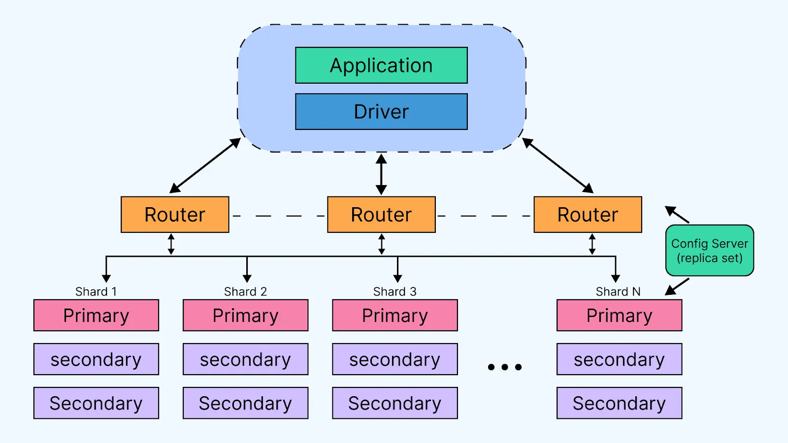

# Übung3

## Aufgabe1

### MongoDB-Cluster-Architektur

MongoDB verfügt drei verschiedene Tier-Ebenen.

1. Client Tier: Anwendungen kommunizieren in Ihrer Implementierungssprache über den passenden "language driver" mit MongoDB. Diese dient als Verbindung zwischen der Anwendung und der MongoDB-Shell (mongosh)

2. Router Tier: In Falle eines Sharded Cluster dienen "mongos"-Instanzen als Query-Router, der Anfragen an die korrekten Shards weiterleitet. Die "mongos" kommuzieren dazu mit den Config Servern (genau 3 Stück) des Clusters.

3. Data Tier: Die eigentlichen Daten werden in Replica Sets gespeichert, die auf mehreren Servern/Maschinen verteilt sind. Dabei besteht jedes Set aus einem Primary und mehreren Secondary-Nodes. Der Primary wird für Schreibvorgänge angesprochen, die Secondaries replizieren diese Änderungen asynchron. Wird im Rahmen der Hearbeat-Kommunikation ein Ausfall eines Primaries festgestellt, wird automatisch ein Wahlverfahren initiiert, um einen Nachfolger zu bestimmen. Dabei schlagen Secondaries sich selbst als Primary vor und bitten andere Nodes um Stimmen. Eine einfache Mehrheit reicht zum Gewinnen des Quorums aus. Für jede shard wird ein eigenes Replica Set angelegt.

 

### Konsistenz

Write-Operationen gelten standardmäßig als erfolgreich, wenn mehr als die Hälfte der Nodes (innerhalb eines Replica Sets) den Schreibvorgang bestätigen. Das Quorum-Ziel kann jedoch mithilfe von `writeConcern` beliebig angepasst werden. Hierbei gilt: Ein höheres Ziel verursacht stärkere Kosistenz und Vice versa.
Read-Operationen können auf unterschiedliche Weisen erfolgen. Hier eine Übersicht über die meist verwendeten `readConcern` Konfigurationen:

| `readConcern`    | Beschreibung                                                                                                                                                                                                                                                                                                  |
| ---------------- | ------------------------------------------------------------------------------------------------------------------------------------------------------------------------------------------------------------------------------------------------------------------------------------------------------------- |
| `"local"`        | (Default) Liest **unbestätigte Daten** vom lokalen Node. Keine Garantien bzgl. Persistenz oder Replikation und dirty reads sind möglich                                                                                                                                                                       |
| `"majority"`     | Liest nur Daten, die von der **Mehrheit der Replica Set-Mitglieder bestätigt** wurden. Bietet Konsistenz auch bei Failovern.                                                                                                                                                                                  |
| `"linearizable"` | Garantiert, dass gelesene Daten **das Ergebnis einer abgeschlossenen Schreiboperation sind**. Anfrage muss direkt an **Primary Node** gesendet werden. Dieser verifiziert seinen Status als Primary und checkt, dass keine neue Wahl in Gange ist. Verursacht hohe Latenz, garantiert aber starke Konsistenz. |

Zudem lässt sich festlegen ob immer von Primary gelesen werden soll oder ob zur Lastverteilung auch von Secondaries gelesen werden kann.

Jedes Replica Set besitzt ein operations log (oplog), eine Liste aller Schreiboperationen die auf dem Primary stattfinden. Jeder Eintrag ist mit einem präzisen logischen Timestamp versehen. Die Secondaries fragen regelmäßig das Oplog des Primary ab und kopieren dieses. Im Falle eines Ausfalls des Primary werden Secondaries deren most recent oplog-Transaktion einen "hohen" Timestamp besitzen, für die Wahl des Nachfolgers bevorzugt.

### PACELC

Mit den default-Settings

1. `writeConcern: { w: 1 }` (bedeutet nur Primiray bestätgt write)
2. `readConcern: "local"` (liest Daten aus lokalem Speicher)

lässt sich MongoDB als PA/EL System klassifizieren. Allerdings lässt sich durch andere Konfigurationen von MongoDB auch die Konsistenz deutlich stärken. So lässt sich durch Anpassen des Quorum-Ziels (`writeConcern: "majority"`) erreichen, dass Schreiboperationen erst dann als erfolgreich gelten, wenn sie von einer Mehrheit der Replica-Set-Mitglieder bestätigt wurden. Ergänzend dazu sorgt ein `readConcern: "majority"` dafür, dass Leseoperationen nur solche Daten zurückgeben, die ebenfalls von einer Mehrheit bestätigt wurden – selbst im Falle eines Failovers bleibt so die Sicht auf bestätigte Daten erhalten.
Für Anwendungen mit besonders hohen Anforderungen an Datenkonsistenz kann zusätzlich `readConcern: "linearizable"` verwendet werden. Damit wird garantiert, dass der Lesevorgang streng sequenziell zum zuletzt erfolgreich bestätigten Schreibvorgang erfolgt – allerdings auf Kosten der Latenz. So kann MongoDB auch als PC/EC-System verwendet werden.

## Aufgabe 2

Da, wie oben beschrieben, ein MongoDB-Cluster nach Belieben auf Konsistenz ausgerichtet werden kann, habe ich mich entschlossen in dieser Aufgabe zwei Konfigurationen `strong_consistency` und `high_throughput` gegeneinander antreten zu lassen. Hiermit untersuche ich den Tradeoff zwischen Kosistenz und Durchsatz innerhalb eines Replication-Sets, während ich die Sharding-Features von MogoDB in Aufgabe 3 thematisiere.

Simuliert wird eine Abstimmung zwischen zwei Kandidaten, wie sie zum Beispiel bei TV-Shows stattfindet. Verwendet habe ich ein lokal laufendes Cluster mit einem auf 3 Nodes verteilten Replica Set (1 Primary, 2 Secondaries). `readConcern` und `writeConcern` Konfigurationen lauten wie folgt:

| Parameter        | `strong_consistency`                      | `high_throughput`                                    |
| ---------------- | ----------------------------------------- | ---------------------------------------------------- |
| `writeConcern`   | `"majority"`                              | `1`                                                  |
| `readPreference` | `PRIMARY`                                 | `SECONDARY_PREFERRED`                                |
| **Ziel**         | Maximale Datenkonsistenz und -sicherheit. | Maximaler Schreibdurchsatz und Lastverteilung.       |
| **Kompromiss**   | Geringerer Durchsatz, höhere Latenz.      | Veraltete Leseergebnisse (stale reads) sind möglich. |

Als Last-Generatoren verwende ich 20 parrallel laufende Threads welche jeweils 2000 Stimmen für einen Kandidaten abgeben. Innerhalb der Thread verwende ich eine einfach while-Schleife, die mithilfe von pymongo direkt in die Datenbank schreiben. Es existieren lediglich zwei Dokumente mit jeweils einer id und den counter, welche durch die Last-Generatoren inkrementiert werden.

### Ergebnisse des Benchmarks

| `high_throughput` | Durchgang 1 | Durchgang 2 | Durchgang 3 | **Durchschnitt** |
| ----------------- | ----------- | ----------- | ----------- | ---------------- |
| Dauer (s)         | 16.87       | 16.83       | 16.28       | **16.66**        |
| Durchsatz (Ops/s) | 2371        | 2376        | 2457        | **2401**         |
| Write-Latenz (ms) | 4.8137      | 4.2336      | 3.7937      | **4.2803**       |
| Read-Latenz (ms)  | 0.2179      | 0.2166      | 0.2140      | **0.2162**       |

| `strong_consistency` | Durchgang 1 | Durchgang 2 | Durchgang 3 | **Durchschnitt** |
| -------------------- | ----------- | ----------- | ----------- | ---------------- |
| Dauer (s)            | 24.91       | 25.80       | 26.45       | **25.72**        |
| Durchsatz (Ops/s)    | 1609        | 1550        | 1512        | **1557**         |
| Write-Latenz (ms)    | 4.2463      | 4.7532      | 5.1658      | **4.7218**       |
| Read-Latenz (ms)     | 0.2212      | 0.2213      | 0.2235      | **0.2220**       |

|                   | **Analyse**                                                                                                                                                                                                                                                                                                                                                                                                                                                                                                                                                                                                                                                                                                                                                                                                                                                                                                                                                                                     |
| ----------------- | ----------------------------------------------------------------------------------------------------------------------------------------------------------------------------------------------------------------------------------------------------------------------------------------------------------------------------------------------------------------------------------------------------------------------------------------------------------------------------------------------------------------------------------------------------------------------------------------------------------------------------------------------------------------------------------------------------------------------------------------------------------------------------------------------------------------------------------------------------------------------------------------------------------------------------------------------------------------------------------------------- |
| Dauer (s)         | Die `high_throughput`-Konfiguration ist etwa 35% schneller, da Schreiboperationen nicht auf die Bestätigung der Mehrheit der Nodes warten müssen.                                                                                                                                                                                                                                                                                                                                                                                                                                                                                                                                                                                                                                                                                                                                                                                                                                               |
| Durchsatz (Ops/s) | Der Durchsatz ist bei `high_throughput` etwa 54% höher , was die verbesserte Leistung bei gelockerten Konsistenzanforderungen zeigt.                                                                                                                                                                                                                                                                                                                                                                                                                                                                                                                                                                                                                                                                                                                                                                                                                                                            |
| Write-Latenz (ms) | Die nahezu identische Write-Latenz in beiden Modi ist auf den ersten Blick überraschend, erklärt sich aber durch die Messmethode. Die opLatencies-Statistik erfasst die serverseitige Ausführungszeit **auf dem Primary**, die in beiden Fällen ähnlich schnell ist. Der signifikante Unterschied in der Gesamtdauer und im Durchsatz entsteht durch die clientseitige Wartezeit: Bei `strong_consistency` muss der Client auf die Bestätigung der Replikation warten, was die Operation aus Sicht der Anwendung verlangsamt.                                                                                                                                                                                                                                                                                                                                                                                                                                                                   |
| Read-Latenz (ms)  | Auch bei der Read-Latenz zeigen die Messungen für beide Modi fast identische Werte. Dies lässt den Schluss zu, dass der Primary-Knoten in dieser Simulation nicht zum Flaschenhals für Leseoperationen wird. Folglich ist die Strategie, Lesevorgänge auf die Secondaries auszulagern (`readPreference = SECONDARY_PREFERRED`), hier nicht nur ohne Performance-Gewinn, sondern sogar kontraproduktiv. Der Nachteil dieser Strategie ist der inhärente Replikations-Lag, der dazu führt, dass Leseanfragen von den Secondaries veraltete Daten zurückgeben. Um diesen Effekt zu demonstrieren, habe ich zusätzlich ein Live-Konsistenz-Monitor entwickelt. Dieser nutzt den oplog des Primaries, um alle 0,5 Sekunden den Replikations-Lag der Secondaries (in Anzahl von Operationen) zu berechnen und auszugeben (siehe Abbildung). Für dieses spezifische Anwendungsszenario wäre es daher sinnvoller, immer direkt vom Primary zu lesen, um aktuelle Daten ohne Latenznachteil zu erhalten. |

 

## Aufgabe 3

### Geplantes Experiment: Workload vs. Skalierung

Die zentrale Hypothese war, dass die Effektivität von horizontaler Skalierung nicht nur von der reinen Anzahl der Knoten, sondern ebenfalls von der Natur der Arbeitslast abhängt. Um dies zu demonstrieren, habe ich widerrum zwei unterschiedliche Szenarien entworfen:

1.  **Szenario "Contention" (Engpass):** Hierbei simuliert eine hohe Anzahl von Threads das ständige Aktualisieren eines **einzigen Dokuments** (`update_one` mit `$inc`). Dies spiegelt den Konflikt um eine einzelne, stark nachgefragte Ressource wider, wie z.B. ein Page-View-Counter einer Produktseite. Die Erwartung war, dass die Leistung hier **nicht** mit zusätzlichen Shards skaliert, da Operationen auf denselben Shard und dasselbe Dokument abzielen und sich gegenseitig blockieren.

2.  **Szenario "Distributed" (Verteilte Last):** In diesem Szenario fügen die Threads kontinuierlich **neue, einzigartige Dokumente** ein (`insert_one`), was einer Protokollierung von einzelnen Events entspricht. Die Erwartung war, dass die Leistung hier mit der Anzahl der Shards skaliert, da die Last ideal auf dem Cluster verteilt werden kann.

Das Ziel war es zu zeigen, dass eine horizontale Skalierung nur dann sinnvoll ist, wenn die Anwendungslogik und die Datenzugriffsmuster eine Parallelisierung erlauben.

Wie schon in Aufagbe 2 habe ich für alle Messungen 20 Threads genutzt, die jeweils 2000 Operationen generieren. Ich habe `writeConcern="majority"` genutzt und die einzelnen Shards wurden nicht repliziert.

### Unerwartete Ergebnisse und schrittweise Optimierung

**Erste Implementierung: `insert_one` vs. `update_one`**

Entgegen der Erwartungen zeigten die ersten Versuche, dass die `distributed`-Variante (`insert_one`) einen **geringeren** Durchsatz als die `contention`-Variante (`update_one`) aufwies.

| Szenario (2 Shards, 1 mongos) | Durchsatz (Ops/s) |
| ----------------------------- | ----------------- |
| `contention`                  | ~2600             |
| `distributed`                 | ~2200             |

Ich hatte folgende zwei Erklärungsansätze für meine Beobachtungen:

**1. Der `mongos`-Router als Bottleneck**

Die erste Vermutung war, dass die einzelne `mongos`-Router-Instanz unter der hohen Last von hunderten parallelen Anfragen zum Engpass wird. Um dies zu beheben, habe ich das Test-Skripte erweitert, um den Start und die Nutzung von **mehreren `mongos`-Instanzen** zu ermöglichen. Der Client (`pymongo`) wurde so konfiguriert, dass er sich mit dem Pool von Routern verbindet und die Last automatisch auf diese verteilt.

| Szenario (2 Shards, 3 mongos) | Durchsatz (Ops/s) |
| ----------------------------- | ----------------- |
| `contention`                  | ~2500             |
| `distributed`                 | ~2400             |

Das Ergebnis war ernüchternd: Auch mit mehreren Routern blieb der Durchsatz beider Szenarien bei hoher Last fast identisch. Die Hypothese, dass der mogos-Router der Bottleneck ist, musste ich also verwerfen. Dies führte zur Schlussfolgerung, dass der limitierende Faktor entweder die **Rechenleistung meiner Testmaschine** sein könnte oder aber der Geschwindigkeitsunterschied zwischen der "update" und "insert" Operation schuld ist.

**2. Unterschied in der Art der Operationen**

1. Bei `update_one` mit `$inc` führt MongoDB eine sehr effiziente In-Place-Modifikation durch. Das Dokument ist bereits im Speicher und benötigt minimale Ressourcen für die Aktualisierung.

2. Bei `insert_one` hingegen muss MongoDB:
    - Ein neues Dokument anlegen
    - Eine eindeutige ID generieren
    - Indizes aktualisieren
    - Das Dokument im Speicher und auf der Festplatte platzieren
    - Metadaten für die Collection aktualisieren

Diese Unterschiede erklären, warum selbst bei Contentions die `update_one`-Operationen überraschend schnell abliefen, während die `insert_one`-Operationen trotz theoretisch besserer Parallelisierungsmöglichkeiten langsamer waren.

In realen Hochleistungssystemen werden selten einzelne Dokumente eingefügt, sondern stattdessen werden Daten in Batches verarbeitet. Dies minimiert den Overhead pro Operation drastisch und erlaubt eine wesentlich effizientere Ressourcennutzung.

Mein neuer Approach war es also nun Operationen zu "sammeln" und in **Batches** zu je 100 Opertionen zu verarbeiten. Um dieses realitätsnähere Verhalten zu simulieren, wurde das `distributed`-Szenario auf die Verwendung von `insert_many` mit `ordered=False` umgestellt. Dieser Ansatz minimiert den Netzwerk- und Router-Overhead drastisch und erlaubt es dem Cluster, die Last effizient zu parallelisieren.

| Clustergröße  | Szenario      | Durchsatz (Ops/s) |
| :------------ | :------------ | :---------------- |
| **2 Shards**  | `contention`  | ~2.500            |
|               | `distributed` | **~73.000**       |
| **5 Shards**  | `contention`  | ~2.400            |
|               | `distributed` | **~42.000**       |
| **10 Shards** | `contention`  | ~2.400            |
|               | `distributed` | **~25.000**       |

### Endanalyse

Die Ergebnisse zeigen deutlich den Unterschied zwischen den beiden Arbeitslasten und deren Skalierungsverhalten:

1. **Contention-Szenario:** Der Durchsatz blieb bei ungefähr 2400-2500 Ops/s konstant, unabhängig von der Anzahl der Shards. Dies bestätigt die Hypothese: Wenn alle Operationen auf dasselbe Dokument abzielen, hilft horizontale Skalierung nicht, da der Konflikt um diese eine Ressource der limitierende Faktor bleibt.

2. **Distributed-Szenario mit Batch-Operationen:** Hier zeigen sich überraschende Ergebnisse. Mit Batch-Operationen erreicht das System zwar einen dramatisch höheren Durchsatz, allerdings sinkt dieser mit steigender Anzahl an Shards.

Diese inverse Skalierung kann auf **Ressourcenlimitierungen der Testumgebung** zurückgeführt werden. In meiner virtuellen Testumgebung mit konstanten Gesamtressourcen nehmen bei zunehmender Knotenanzahl die verfügbaren Ressourcen pro Knoten ab. Gleichzeitig steigt der Koordinationsaufwand im Cluster an.
Trotz dieser Limitierung konnte die grundlegende Hypothese bestätigt werden: Ein parallelisierbarer Workload erreicht signifikant höhere Durchsatzraten als ein Workload mit hoher Ressourcenkonkurrenz.

Der Test zeigt, dass die optimale Cluster-Größe stark von der spezifischen Arbeitslast, der verfügbaren Hardware und der Effizienz der Kommunikation zwischen den Komponenten abhängt. Ein "größer ist besser"-Ansatz funktioniert nicht immer, und für manche Szenarien kann ein überdimensioniertes Cluster sogar kontraproduktiv sein. Basierend auf den Experimenten lassen sich folgende Best Practices für effektives horizontales Skalieren ableiten:

1.  **Parallelisierbarkeit der Arbeitslast:** Wie im `contention`-Szenario gezeigt, kann selbst ein riesiges Cluster die Performance nicht verbessern, wenn alle Anfragen auf eine einzige, nicht teilbare Ressource abzielen. Die Arbeitslast selbst muss es erlauben, auf mehrere Knoten verteilt zu werden.

2.  **Effiziente Client-Kommunikation:** Wie die Entwicklung des `distributed`-Szenarios zeigte, ist der Overhead von tausenden Einzelanfragen ein signifikanter Performance-Killer. Erst durch die Umstellung auf Batch-Operationen (`insert_many`) konnte der Client-seitige Engpass beseitigt und die wahre Skalierbarkeit des darunterliegenden Sharded Clusters aufgedeckt werden.

3.  **Balancierung der Hardware-Ressourcen:** Wie unsere Tests gezeigt haben, kann das Hinzufügen von Nodes bei begrenzten Gesamtressourcen zu einer suboptimalen Ressourcenverteilung führen. In Produktionsumgebungen muss sichergestellt werden, dass jeder Knoten über ausreichende CPU-, Speicher- und Netzwerkkapazitäten verfügt, um seine Aufgaben effizient zu erfüllen. Dabei sollten **beide** Skalierungsdimensionen (horizontal und vertikal) betrachtet werden, um ein optimales Gleichgewicht zu finden.
